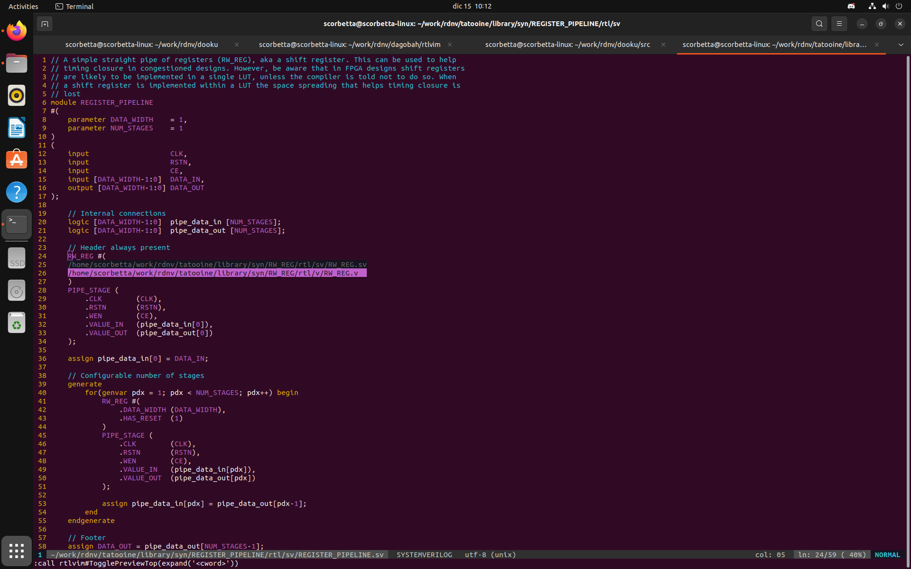
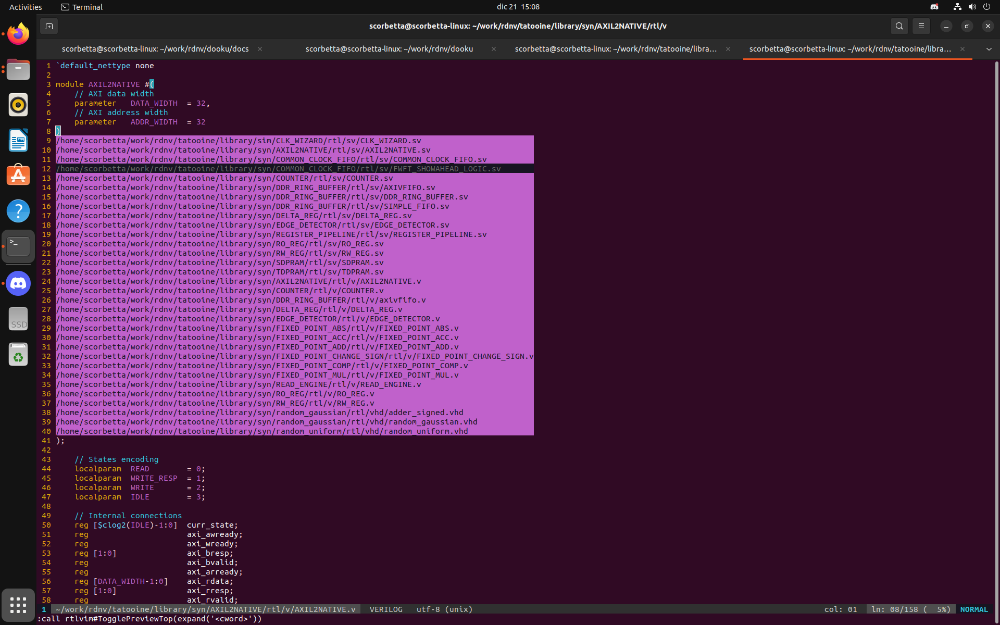
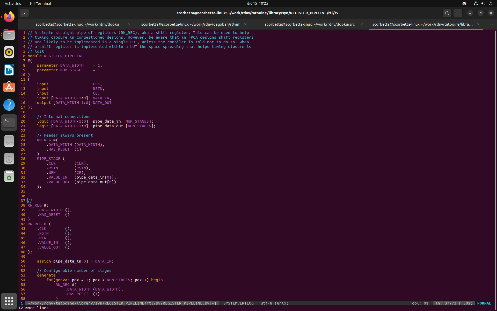

`dagobah` contains scripts and utilities of general use.

## `rdnv` configuration
To be able to use the resources of the `rdnv` repository, the following lines must be added to
`~/.bashrc`:

```bash
# Absolute location of cloned rdnv.git repo
export RDNV_ROOT=/home/user/rdnv
export TATOOINE_ROOT=${RDNV_ROOT}/tatooine
export ORGANA_ROOT=${RDNV_ROOT}/organa
export DAGOBAH_ROOT=${RDNV_ROOT}/dagobah
export PYTHONPATH="${PYTHONPATH}:${TATOOINE_ROOT}/cocotb"
```

## `rtlvim` plugin
The author's preferred and only editor is [vim](https://www.vim.org/). `rtlvim` is a plugin that
helps RTL designers.

The plugin integrates with the `tatooine` library of RTL components, and allows RTL designers to
easily retrieve modules definitions to be used in their own RTL code! Once enabled, the plugin
allows any designer to preview the definition of any module from the `tatooine` library, create an
instance and copy it into the current VIM buffer.

The plugin is managed through the [`vim-plug`](https://github.com/junegunn/vim-plug) plugin manager.
Configuration is straightforward, just add the following line within the `plug#begin`/`plug#end`
pairs in `~/.vimrc`:

```
Plug '/home/user/rdnv/dagobah/rtlvim'
```

There are three keys mapped to specific `rtlvim` functions: `<F2>`, `<F3>` and `<F4>`. By pressing
`<F2>`, the entire *WORD* under the cursor is interpreted as an RTL module. The plugin will first
search for a module named *WORD.[v|sv|vhd]* located anywhere beneath the `${TATOOINE_ROOT}/library`
folder. If a single file is found, a preview is automatically open in a separate window; if the same
module is found in different flavors (i.e., different implementations as in *WORD.v* or *WORD.vhd*)
then a menu appears and the user can choose which implementation to open; if none is found, a menu
is open with all RTL modules found within the `tatoiine` library. In the multiple- and none-match
cases the user is free to press the `<Enter>` key to open the preview. A second press on `<F2>`
closes the preview.

In the following examples, `<F2>` is first hit just above the `RW_REG` module and then in a blank
space.





By pressing `<F3>` over a module known to `dagobah`, i.e. a module *WORD* for which a *WORD.json*
file exists in the `tatooine` library of components, an instance is created and copied into register
`z` for later use. At this point the  plugin engine recognizes the target HDL language from the
extension of the file currently opened in the buffer. The instance can then be pasted under the
cursor with `<F4>`.

The following screenshots shows a new instance of `RW_REG` named `RW_REG_0` is copied.



Please notice that if no *WORD.json* file is found, the `z` register is *not* overwritten. This
means that any hit on `<F4>` will paste the previous match, if any.
