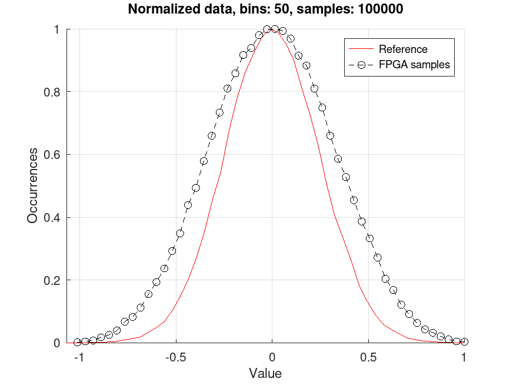

# random_gaussian

## Features
An engine that generates Normally distributed pseudo-random values. The sample distribution *might
not be exactly* Normally distributed from a statistichal stand, however it is enough for those use
cases where statistichal features are **not** a must.

## Principles of operation
Generating Normal samples is difficult in Hardware. The proposed design leverages the central limit
theorem. The design sums up 4 (four) independent and identically distributed random variables, from
a Uniform distribution.

LFSR is used to generate the base variables, parallel instances of the `random_uniform` block. Using
less than 4 (four) makes the output distribution look like triangular; using more than 4 (four)
makes the design more complex.

## Parameters
| NAME | TYPE | DEFAULT | NOTES |
|-|-|-|-|
| OUT_WIDTH | integer | 12 | Output value width |

## Ports
| NAME | DIRECTION | WIDTH | NOTES |
|-|-|-|-|
| clk | input | 1 | Clock signal |
| rst | input | 1 | Active-high reset |
| random | output | OUT_WIDTH | Generated value |

## Design notes
The Gaussian generator is based on multiple LFSRs sum implementation, whose credits go to [Henrik
Forstén](https://hforsten.com/generating-normally-distributed-pseudorandom-numbers-on-a-fpga.html).

## OOTBTB
The testbench can be used to evaluate the goodness of the engine. One value is generated every clock
cycle, thanks to the two-level parallel sum architecture. At every cycle, the generated value is
sent to a `random_gaussian.csv` text file that can be later processed.

The following Matlab script can be used to generate a comparison of normalized data between FPGA
samples and reference samples. Reference samples are generated through the Matlab engine, using the
number of samples from the FPGA sample population. Comparison is qualitative, but enough to make the
point. Better statistichal properties can be achieved by increasing the number of i.i.d. variables
and the number of samples.

```matlab linenums="1"
# Statistics package is require
pkg load statistics

# Number of bins
bins = 50;

# Data from FPGA
fpga_data = load('random_gaussian.csv');
fpga_samples = size(fpga_data, 1);

# Data from Matlab engine
ref_data = normrnd(0, 1, fpga_samples, 1);

# Get histograms
[ y_fpga, x_fpga ] = hist(fpga_data, bins);
[ y_ref, x_ref ] = hist(ref_data, bins);

# Normalize data for fair comparison
y_fpga = y_fpga ./ max(y_fpga);
x_fpga = x_fpga ./ max(x_fpga);
y_ref = y_ref ./ max(y_ref);
x_ref = x_ref ./ max(x_ref);

# Plot one against the other
figure;
hold all;
plot(x_ref, y_ref, '-r');
plot(x_fpga, y_fpga, '--ok');
grid on;
xlabel('Value');
ylabel('Occurrences');
title(sprintf('Normalized data, bins: %d, samples: %d', bins, fpga_samples));
legend('Reference', 'FPGA samples');
axis tight;

# Save to file
print -dpng random_gaussian.png;
close;
```

Plot output `random_gaussian.png` is shown:


